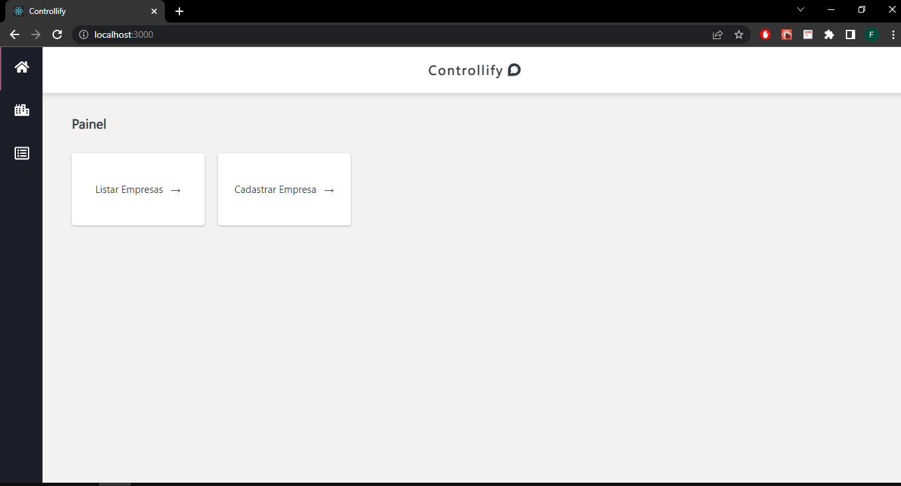
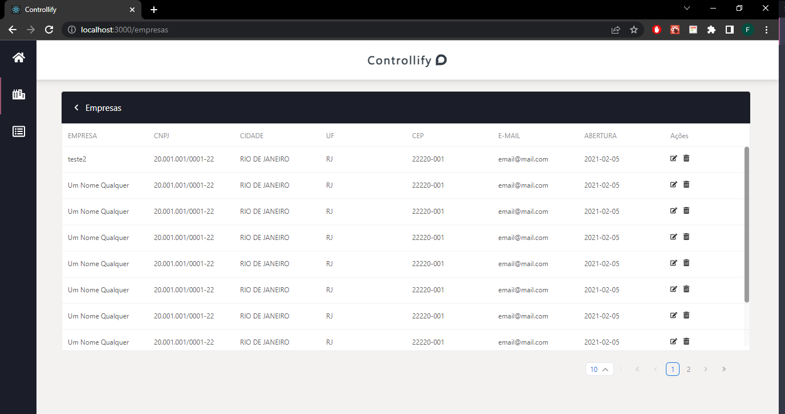
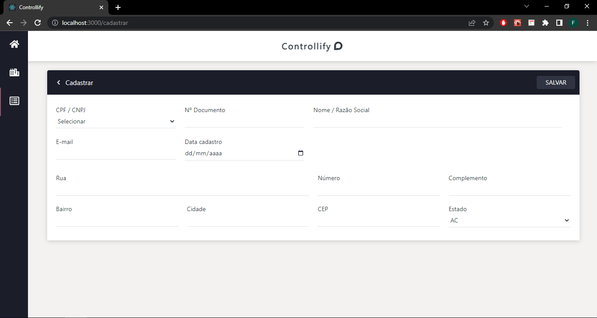
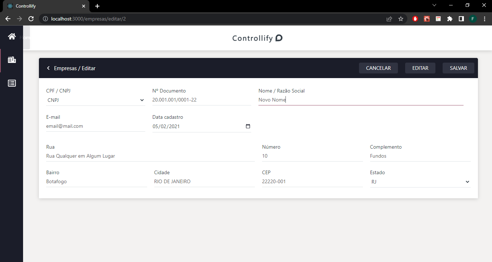

## Controle de Cadastros

- Trata-se de o desenvolvimento de um exemplo de sistema para que usuário possam cadastrar, editar e deletar uma empresa no banco de dados fictício.

## Sumário

- [Tecnologias utilizadas](#tecnologias)
- [Instruções para rodar o projeto](#instrucoes)
- [Organização e estruturação do projeto](#organizacao)
- [Desenvolvimento](#desenvolvimento)
- [Imagens](#imagens)

## Tecnologias Utilizadas <a name="tecnologias"></a>

- [**React**](https://pt-br.reactjs.org/)
- [**React Hooks**](https://pt-br.reactjs.org/docs/hooks-intro.html)
- [**React Router Dom**](https://www.npmjs.com/package/react-router-dom)
- [**Styled Components**](https://styled-components.com/)
- [**React Icons**](https://react-icons.github.io/react-icons/)
- [**Axios**](https://axios-http.com/docs/intro)
- [**React Redux**](https://react-redux.js.org/)
- [**Redux Tookit**](https://redux-toolkit.js.org/)
- [**React Suite**](https://rsuitejs.com/)
- [**Json Server**](https://www.npmjs.com/package/json-server)

## Instruções para rodar o projeto <a name="instrucoes"></a>

### Será necessário ter instalado na sua máquina:

```
Git
React
```

- Clone o repositório com o comando **git clone**:

```
git clone https://github.com/felipehimself/controllify.git
```

- Entre no diretório que acabou de ser criado:

```
cd controllify
```

- Para o projeto funcionar na sua máquina, será necessário instalar suas dependências, para isso, utilize o comando **npm install**:

```
npm install
```

- Para rodar o servidor de teste será necessário, também, instalar o **Json Server**, para isso, utilize o seguinte comando:

```
npm install -g json-server
```

- Agora, com o **Json Server** instalado, utilize o seguinte comando, para rodar o servidor de teste:

```
json-server --watch db.json --port 3004
```

> Atenção: este comando deve ser executado na raiz do projeto.

- Pronto, agora o projeto está pronto para ser rodado localmente, utilizando o comando **npm start**:

```
npm start
```

## Organização e estruturação do projeto <a name="organizacao"></a>

O projeto está estruturado da seguinte forma:

```
│   .gitignore
│   db.json
│   package-lock.json
│   package.json
│   README.md
│   tsconfig.json
│
├───public
│       favicon.ico
│       index.html
│       manifest.json
│       robots.txt
│
└───src
    │   App.test.tsx
    │   App.tsx
    │   index.tsx
    │   mock.ts
    │   react-app-env.d.ts
    │   reportWebVitals.ts
    │   setupTests.ts
    │
    ├───assets
    │       spinner.svg
    │
    ├───components
    │   ├───elements
    │   │       ConfirmModal.tsx
    │   │       FormCadastrar.tsx
    │   │       FormEditar.tsx
    │   │       Header.tsx
    │   │       Sidebar.tsx
    │   │       TableEmpresas.tsx
    │   │
    │   └───ui
    │           Card.tsx
    │           Loading.tsx
    │           PopUpError.tsx
    │           TableTitle.tsx
    │
    ├───data
    │       dadosGerais.ts
    │
    ├───features
    │       buttonsSlice.ts
    │       confirmSlice.ts
    │       dataSlice.ts
    │       errorSlice.ts
    │
    ├───hooks
    │       useFetch.tsx
    │
    ├───interfaces
    │       interfaces.ts
    │
    ├───pages
    │       Cadastrar.tsx
    │       Editar.tsx
    │       Empresas.tsx
    │       Home.tsx
    │
    ├───store
    │       store.ts
    │
    ├───styles
    │       globalStyles.tsx
    │       styles.ts
    │
    └───utils
            utils.ts    
```

## Desenvolvimento <a name="desenvolvimento" ></a>

### HTTP Requests

Para realizar chamadas HTTP no banco de dados fictício, foi utilizado o client HTTP [**Axios**](https://axios-http.com/docs/intro).

### Rotas

Para criação das rotas que servirão as páginas foi utilizado o package React Router Dom  [**React Router Dom**](https://v5.reactrouter.com/web/guides/quick-start).

### Controle de estado

Para controle de estados foi utilizado o package Redux toolkit  [**Redux Toolkit**](https://redux-toolkit.js.org/).
Em complemento à utilização do Redux Toolkit, foi necessária a utilização do package [**React Redux**](https://react-redux.js.org/)

### Estilização

Para realizar a estilização, foi utilizado o framework [**Styled Components**](https://styled-components.com/).

### Tabela

Para criação de uma tabela responsiva, foi utilizada a  biblioteca React Suite [**React Suite**](https://rsuitejs.com/components/table/)


## Imagens <a name="imagens" ></a>


 

 

 

 


